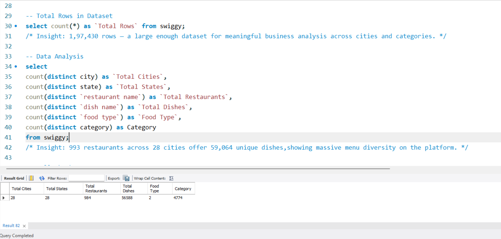

# Swiggy Food Orders Analysis
 


> **Self-Made Project**   
> A comprehensive SQL analysis of Swiggy food order data covering 1,97,430 orders across 993 restaurants, 28 cities, and 59,064 unique dishes — using advanced MySQL with views, stored procedures, window functions, subqueries, and string functions.

---

## Project Overview

This project performs an end-to-end SQL analysis on Swiggy's food ordering platform data to uncover patterns in restaurant performance, dish pricing, food type preferences, city-wise demand, time-based ordering trends, and customer behaviour.

**Key business questions answered:**
- Which cities and states generate the most orders?
- How do Veg vs Non-Veg dishes compare in volume and pricing?
- What are the peak ordering days, weeks, and months?
- Which restaurants have the best ratings and largest menus?
- How are dishes distributed across price categories (Budget to Luxury)?
- What hidden data quality issues exist in the dataset?

---

## Tools Used

| Tool | Purpose |
|------|---------|
| **MySQL Workbench** | All analysis — EDA, filtering, aggregation, window functions, subqueries, string functions, views, stored procedures |

---

## SQL Query Screenshots

| File Name | Description |
|-----------|-------------|
| [SW1.png](SW1.png) | Dataset scale analysis showing 28 cities, 993 restaurants, and 59,064 dishes |
| [SW2.png](SW2.png) | Data quality validation across 14 columns confirming zero missing values |
| [SW3.png](SW3.png) | Food type analysis using window functions comparing Veg (71.5%) and Non-Veg (28.5%) dishes |
| [SW4.png](SW4.png) | HAVING clause analysis identifying Panaji and Lucknow as the only cities with average dish price above ₹300 |
| [SW5.png](SW5.png) | Weekday vs Weekend order distribution analysis showing 70.92% of orders placed on weekdays |
| [SW6.png](SW6.png) | Price category segmentation using CASE WHEN, with Mid-Range dishes leading at 58.51% |
| [SW7.png](SW7.png) | View creation and output for `vw_city_summary` and `vw_top_rated_dishes` |
| [SW8.png](SW8.png) | Stored procedures (`GetTopDishes`, `cityreport`) along with CALL execution results |

---

## Key Business Insights

### Dataset Overview
| Metric | Value |
|--------|-------|
| Total Rows | 1,97,430 |
| Total Cities | 28 |
| Total Restaurants | 993 |
| Total Unique Dishes | 59,064 |
| Null Values | 0 across all 14 columns |

### Pricing Insights
- **Average dish price: ₹268.51** with range from ₹0.95 to ₹8,000
- **77,848 dishes (39.4%)** are priced above the platform average
- **Only 2 cities** have avg price above ₹300: **Panaji (₹306)** and **Lucknow (₹305)**
- Metros like Mumbai and Delhi fall below ₹300 — platform-wide price sensitivity
- **Non-Veg dishes are pricier** than Veg on average

### Price Category Distribution
| Category | Dishes | Percentage |
|----------|--------|------------|
| Mid-Range (₹150–₹400) | 1,15,514 | 58.51% |
| Budget (below ₹150) | — | 27.45% |
| Premium (₹400–₹800) | — | 11.86% |
| Luxury (above ₹800) | — | 2.18% |

**Platform is value-market driven** — Mid-Range dominates at 58.51%

### Food Type Distribution
| Food Type | Orders | Percentage |
|-----------|--------|------------|
| Veg | 1,40,604 | ~71.5% |
| Non-Veg | 56,826 | ~28.5% |

- ALL 28 cities have more Veg listings than Non-Veg — without exception
- **'Weekday | Veg'** is the biggest order segment — **99,745 orders, avg ₹240**
- Daily habit-based Veg ordering drives Swiggy's core volume, not weekend splurges

### Time-Based Insights
- **Busiest day: Saturday (28,938 orders)**, followed by Sunday (28,474)
- **Tuesday is the slowest day** — not Monday as expected
- **Weekdays: 70.92% (1,40,018)** vs Weekends: 29.08% (57,412) — opposite of assumptions
- **Busiest date: 22nd Feb 2025 (Saturday)** — 1,550 orders
- **Q2 leads** quarterly orders — summer + IPL season effect
- **Q1 has highest avg price** (₹269.07), Q2 has most orders (74,163)
- January leads monthly with 25,398 orders — steady demand year-round

### Rating Insights
- Avg rating: ~4.0 — healthy platform-wide quality
- ALL 28 cities pass: 1000+ orders AND avg rating > 3.8
- **Kochi leads** avg rating (4.44), followed by Aizawl and Kolkata (4.41)
- Majority of dishes are "Unrated" or "Low (1–25)" — many new/low-traffic items

### Views Created
| View | Purpose |
|------|---------|
| `vw_city_summary` | City-wise: total orders, restaurants, avg price, avg rating |
| `vw_top_rated_dishes` | Dishes with rating > 4.5 AND rating count >= 100 — curated best dishes |

### Stored Procedures Created
| Procedure | Parameters | Purpose |
|-----------|------------|---------|
| `GetTopDishes(city_name, top_n)` | City + N | Top N dishes by order count for any city |
| `cityreport(city_name)` | City name | Full city report — orders, restaurants, avg price, avg rating |

---

## SQL Sections & Concepts

### Section 1 — Database Setup & Loading
- `CREATE DATABASE`, `LOAD DATA INFILE` with latin1 encoding

### Section 2 — Basic EDA
- Total rows, distinct counts, NULL check (all 14 columns), price stats, rating stats, food type %, date range, quarter/day-wise orders

### Section 3 — Filtering & Pattern Matching
- `WHERE`, `BETWEEN`, `IN`, `LIKE`, `<>`, `REGEXP`
- Bengaluru premium dishes, Non-Veg filter, metro cities, Biryani search, unrated premium dishes

### Section 4 — Aggregation & HAVING
- City-wise, state-wise, food type aggregations
- `HAVING avg_price > 300`, `HAVING total_dishes > 50`, `HAVING veg_count > nonveg_count`

### Section 5 — Time Analysis
- `YEAR()`, `MONTH()`, `MONTHNAME()`, `DAY()`, `DAYNAME()`, `WEEKOFYEAR()`, `DATEDIFF()`
- Monthly, weekly, quarter-wise, busiest date, weekend vs weekday split

### Section 6 — Advanced SQL
- **CASE WHEN** — 4-tier price labels, restaurant performance labels, day-type flags
- **Window Function** — `SUM(COUNT(*)) OVER()` for percentage
- **Subquery** — `WHERE price > (SELECT AVG(price) FROM swiggy)`
- **REGEXP** — Biryani spelling variant detection
- **String Functions** — `UPPER()`, `LENGTH()`, `LEFT()`, `TRIM()`, `REPLACE()`
- **CONCAT** — combined segment labels (Weekend | Veg)

### Section 7 — Views
- `vw_city_summary` — reusable city-level aggregation view
- `vw_top_rated_dishes` — curated best dishes view (rating > 4.5, count >= 100)

### Section 8 — Stored Procedures
- `GetTopDishes(city_name VARCHAR, top_n INT)` — parameterized top dishes query
- `cityreport(city_name VARCHAR)` — instant city KPI report

---

## Project Structure

```
09_Swiggy-Analysis/
│
├── README.md                    ← You are here
│
├── data/
│   ├── Swiggy.csv               ← Raw Swiggy dataset (1,97,430 rows)
│   └── README.md
│
├── sql/
│   ├── Swiggy_Analysis.sql      ← Complete SQL file
│   └── README.md
│
└── Screenshots/
    ├── SW1.png                  ← Dataset scale output
    ├── SW2.png                  ← Null check — all zeros
    ├── SW3.png                  ← Food type window function
    ├── SW4.png                  ← HAVING — Panaji & Lucknow
    ├── SW5.png                  ← Weekend vs Weekday split
    ├── SW6.png                  ← Price category CASE WHEN
    ├── SW7.png                  ← Views with output
    └── SW8.png                  ← Stored Procedures with CALL output
```

---

## Dataset

| Property | Value |
|----------|-------|
| **Source** | Swiggy Food Orders Dataset |
| **Table** | `swiggy` (MySQL) |
| **Total Rows** | 1,97,430 |
| **Key Fields** | restaurant name, dish name, city, state, food type, category, price (INR), rating, rating count, order date, week_no, quarter, day, location |

---

## Author

**Piyush Kumar*  
Data Analyst | SQL · Power BI · Tableau · Excel · Python
